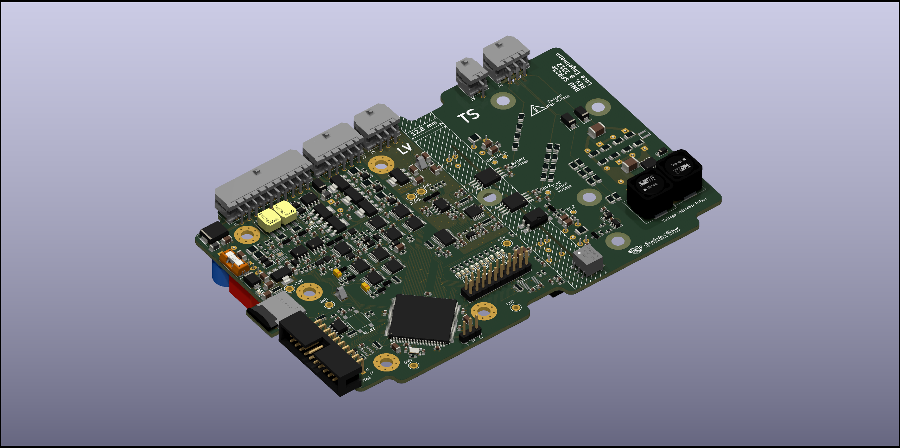

# spr23e-bmu
Disclaimer: This project is free to use. However, if you plan to use it at an official Formula Student event you have to clearly state the origin of the project in your presentation of the Engeneering Design Event! This project contains lethal voltages. You use this project at your own risk! Neither I nor the Scuderia Mensa will take any responsibility in case of damage, fire, injury or death.

Battery Management Unit for the Scuderia Mensa SPR23e/SPR24e electric race car.

REV B has been successfully tested. Rendering: 

The documentation is still in progress and far from finished. Firmare can be found here: https://github.com/derlucae98/spr-bmu-firmware

